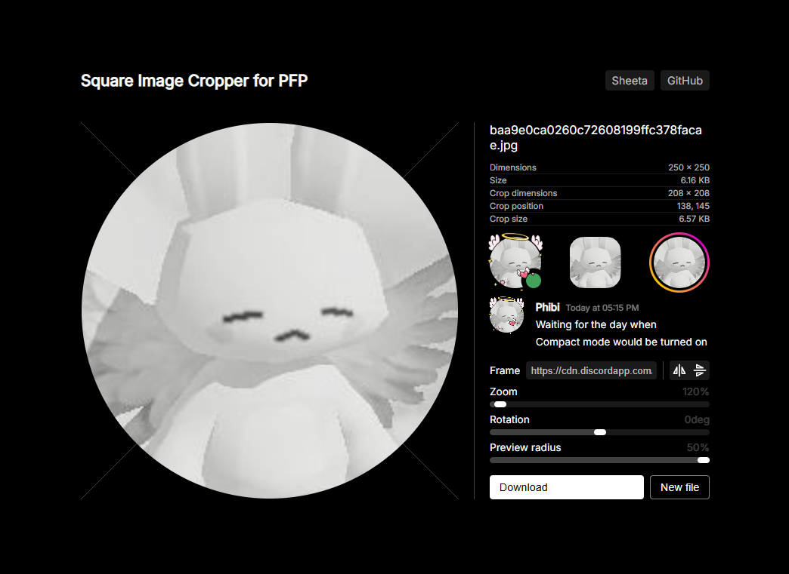

# Square Image Cropper for Social Media Profile Icon
This website is designed for cropping images into a square for social media profile icons. While there are several websites that allow you to crop images into a square, I created this site because I wanted to see how the icon would actually look when set as a profile picture after cropping.  
You can adjust the position and zoom level by dragging and using the mouse wheel while checking the icon preview on the right side. The preview icons are for Discord (with online indicator), Discord server, Instagram, and Discord message.  
PNG images are saved as PNG, and all others are saved as JPG. Please note that cropping does not include the preview radius.

## How to Use
1. Go to [this website](https://sheetau.github.io/cropimage.github.io/).
2. Upload image you want to crop.
3. Drag image to adjust crop position. use mouse wheel on image or use zoom slider to adjust crop size.
4. Use preview radius slider or click preview icons on right side to adjust corner radius of preview.
5. Click download.
