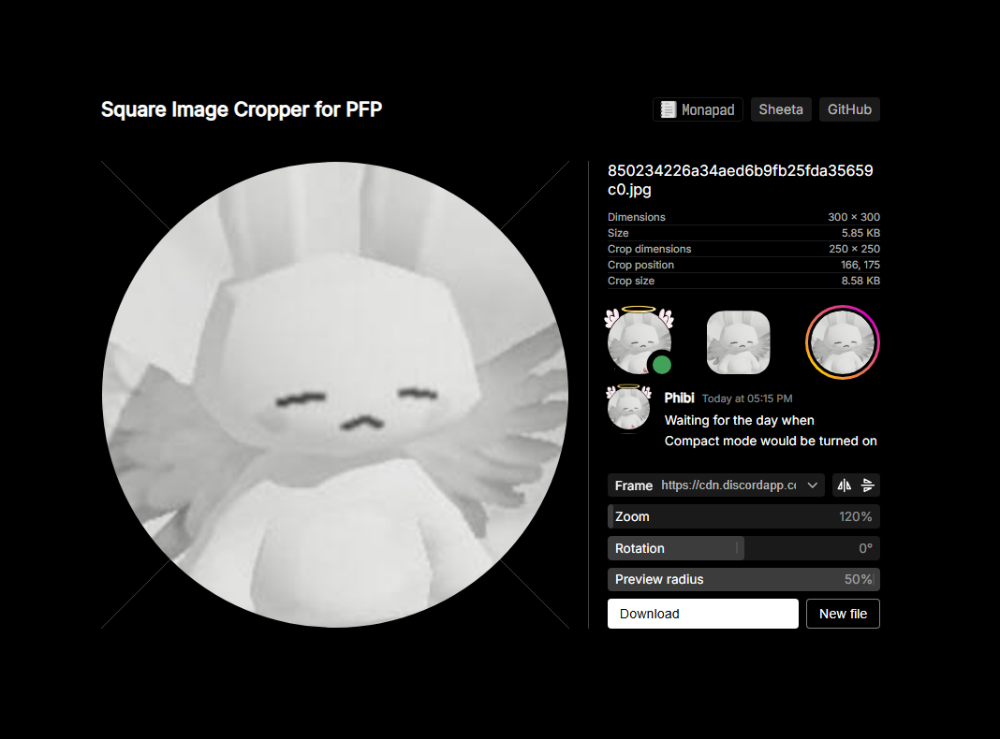

# Square Image Cropper for PFP

**This website lets you crop images into a square while previewing how your icon will look as a social media profile picture.**

There are several websites let you crop images into a square, and you can even set a profile picture without cropping at all. However, you usually can't see how it will actually look until after you set it, and adjusting it over and over again can be a hassle. That's why I created this website. It lets you crop images into a square while previewing how your icon will look as a social media profile picture.

## How to Use

1. Go to [this website](https://sheetau.github.io/cropimage.github.io/).
2. Drag and drop or click to select and upload the image you want to crop.
3. Drag image to adjust position. Use mouse wheel or the zoom slider to adjust crop size.
4. Use the rotation slider or Shift + Mouse Wheel to rotate the image.
5. Use flip buttons to toggle horizontal or vertical orientation.
6. Use preview radius slider or click preview icons on right side to adjust corner radius.
7. Click download. (PNG images are saved as PNG, others as JPG. Cropping does not include preview radius.)
